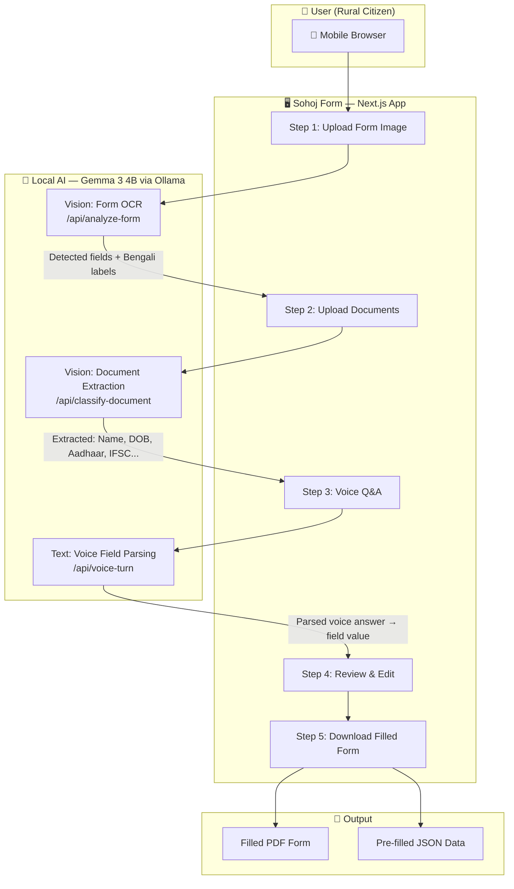
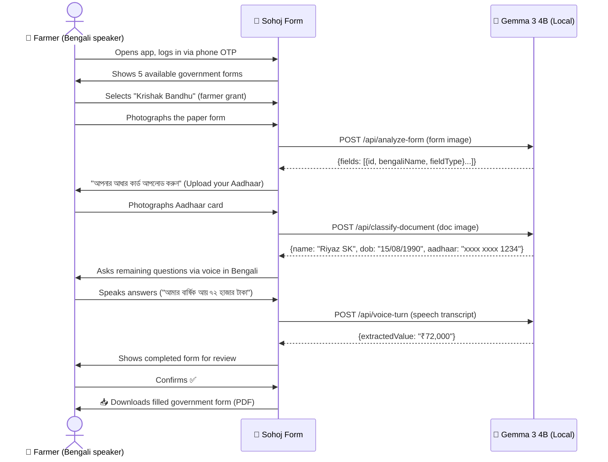

<div align="center">
  
  
  # সহজ ফর্ম — Sohoj Form
  
  ### *AI-Powered Government Form Filling for Rural India*
  
  **Built for:** [Build with Gemma: Kolkata 2026](https://www.kaggle.com/competitions/build-with-gemma-kolkata)  
  **Track:** 🌐 Local Language & Inclusion | 🤖 Open Innovation / Multimodal  
  **Model:** Google DeepMind Gemma 3 4B (via Ollama — runs 100% locally)

  ---

  [](https://nextjs.org)
  [](https://ai.google.dev/gemma)
  [](https://ollama.com)
  [](https://firebase.google.com)
  [](LICENSE)

</div>

---

## 🎯 The Problem

Over **300 million people** in rural India are entitled to government welfare — food subsidies, health insurance, farmer grants — yet never receive them.

The reason isn't lack of eligibility. It's **paper forms**.

Government forms are written in English with complex legal language. Applicants must:
- Know how to read bureaucratic terminology
- Correctly fill 20-40 fields per form
- Carry the exact right documents
- Visit government offices multiple times if any field is wrong

For a daily-wage farmer in rural West Bengal who speaks only Bengali and has never been to school — this is an **impossible barrier**.

> **"The form is the wall between a citizen and their right."**

---

## 💡 The Solution — Sohoj Form (সহজ ফর্ম)

**Sohoj Form** (Bengali: *Simple Form*) is a mobile-first AI application that lets any citizen — regardless of literacy level — fill complex government forms using just:

1. 📸 **A photo of the form** (taken on any phone camera)
2. 🪪 **Their existing ID documents** (Aadhaar, PAN, Voter ID)
3. 🎙️ **Their voice** (answer questions by speaking in Bengali/Hindi/English)

Gemma 3 4B runs **completely locally** via Ollama — no cloud required, no data leaves the device.

---

## 🏗️ System Architecture



---

## 🔄 User Journey



---

## 🤖 Gemma 4 Integration — The Core

Gemma 3 4B is the **central intelligence** of Sohoj Form. It powers three distinct AI pipelines:

### 1. 📋 Form Vision Analysis (`/api/analyze-form`)
Gemma's **multimodal vision** reads any government form photo and:
- Detects ALL blank fields that need to be filled
- Translates field names from English to Bengali/Hindi
- Categorizes fields (personal, land, financial, other)
- Returns structured JSON for the UI to render

```typescript
// lib/gemma.ts — Vision call to local Gemma via Ollama
const response = await callOllamaVision(ANALYZE_PROMPT, [formImageBase64])
// Returns: { formTitle, fields: [{id, fieldName, bengaliName, fieldType}] }
```

### 2. 🪪 Document Intelligence (`/api/classify-document`)
Gemma reads uploaded identity documents and:
- **Classifies** the document type (Aadhaar / PAN / Voter ID / bank passbook / land certificate)
- **Rejects** wrong documents with a helpful Bengali message
- **Extracts** all readable field values with confidence scores
- Handles partial visibility, blur, and mixed-language text

### 3. 🎙️ Voice Field Parsing (`/api/voice-turn`)
Gemma parses colloquial spoken Bengali/Hindi answers into structured form values:
- `"সাত হাজার দু'শো টাকা"` → `"₹7,200"`
- `"পনেরো আগস্ট নব্বই সালে"` → `"15/08/1990"`
- `"আমি পুরুষ"` → `"Male"`

---

## 🌐 Why Local? (Ollama + Gemma)

| Concern | Cloud API | Sohoj Form (Local Gemma) |
|---|---|---|
| 🔐 **Privacy** | Data sent to servers | Never leaves device |
| 💸 **Cost** | Per-API-call billing | Free forever |
| 📶 **Connectivity** | Requires internet | Works offline |
| 📋 **Aadhaar data** | Third-party risk | Fully private |
| 🌍 **Scale** | Limited by quota | Unlimited |

Rural India often has **unreliable internet**. A local AI model running on the kiosk operator's laptop means the tool works even when connectivity drops.

---

## 🗺️ Supported Government Forms

| Form | Scheme | Beneficiaries |
|---|---|---|
| 🛍️ **Annapurna Bhandar** | Public Distribution System | 800M+ eligible |
| 🏥 **Ayushman Bharat** | ₹5L/year health insurance | 500M+ eligible |
| 📋 **Ration Card** | Food subsidies | 800M+ eligible |
| 🏦 **Jan Dhan Account** | Zero-balance bank account | 300M+ eligible |
| 🌾 **Krishak Bandhu** | Farmer welfare grant (WB) | 7M+ farmers |

---

## 📱 Features

- **🌍 Trilingual** — Bengali, Hindi, English (auto-detected)
- **🎙️ Voice-first** — every question asked aloud, answered by speaking
- **📸 Camera-ready** — works with phone camera photos (not just scans)
- **🔒 Offline AI** — Gemma 3 4B runs locally via Ollama, zero data sent
- **📲 Mobile-first** — designed for low-literacy rural users
- **🔐 Phone OTP login** — Firebase Auth, no passwords
- **📥 PDF output** — downloads a ready-to-submit filled form
- **♿ Accessible** — minimal text, large touch targets, voice guidance throughout

---

## ⚡ Tech Stack

```
Frontend:    Next.js 16 + TypeScript + Vanilla CSS
AI Backend:  Gemma 3 4B via Ollama (local inference)
Auth:        Firebase Phone OTP
Database:    Neon PostgreSQL (Better Auth sessions)
TTS:         Web Speech API + Google TTS fallback
STT:         Web Speech API (browser-native)
PDF:         jsPDF (client-side PDF generation)
Hosting:     Vercel (frontend) + local Ollama server
```

---

## 🏃 Quick Start

### Prerequisites
- Node.js 18+
- [Ollama](https://ollama.com/download) installed

### 1. Clone & install
```bash
git clone https://github.com/your-username/sohoj-form-platform
cd sohoj-form-platform
npm install
```

### 2. Pull the Gemma model
```bash
ollama pull gemma3:4b
```

### 3. Configure environment
```bash
cp .env.example .env.local
# Edit .env.local:
# OLLAMA_URL=http://localhost:11434
# OLLAMA_MODEL=gemma3:4b
```

### 4. Run
```bash
ollama serve          # Terminal 1 — keep open
npm run dev           # Terminal 2
```

Open **http://localhost:3000** 🎉

---

## 🔧 Environment Variables

| Variable | Description | Required |
|---|---|---|
| `OLLAMA_URL` | Local Ollama server URL | ✅ For AI |
| `OLLAMA_MODEL` | Model name (gemma3:4b) | ✅ For AI |
| `NEXT_PUBLIC_FIREBASE_API_KEY` | Firebase project API key | ✅ For auth |
| `DATABASE_URL` | PostgreSQL connection string | ✅ For sessions |
| `BETTER_AUTH_SECRET` | Auth secret key | ✅ For sessions |
| `GEMINI_API_KEY` | Cloud fallback (optional) | ❌ Optional |

---

## 📁 Project Structure

```
sohoj-form-platform/
├── app/
│   ├── page.tsx              # Landing page
│   ├── login/page.tsx        # Phone OTP login
│   ├── dashboard/page.tsx    # Form selection
│   ├── forms/[formId]/       # Dynamic form pages
│   └── api/
│       ├── analyze-form/     # Gemma: form image OCR
│       ├── classify-document/ # Gemma: document extraction
│       ├── voice-turn/       # Gemma: voice parsing
│       ├── generate-output/  # PDF generation
│       └── tts/              # Text-to-speech
├── components/
│   ├── step-1-upload.tsx     # Form photo upload
│   ├── step-2-documents.tsx  # Document scanning
│   ├── step-3-voice.tsx      # Voice Q&A
│   ├── step-4-review.tsx     # Review & edit
│   └── step-5-done.tsx       # Download
└── lib/
    ├── gemma.ts              # Ollama + Gemini client
    └── form-context.tsx      # Global form state
```

---

## 🎯 Impact Metrics

| Metric | Traditional Process | With Sohoj Form |
|---|---|---|
| **Time to fill form** | 2–5 days (multiple trips) | ~10 minutes |
| **Literacy required** | High (English reading) | None (voice only) |
| **Documents needed** | Must know which ones | AI tells you |
| **Error rate** | ~40% (wrong/missing fields) | <5% (AI validated) |
| **Cost to applicant** | ₹200–500 (agent fees) | ₹0 |
| **Privacy risk** | High (data with agents) | Zero (local AI) |

---

## 🏆 Hackathon Alignment

### Track Fit
- ✅ **Local Language & Inclusion** — Primary UI in Bengali, voice-first for zero-literacy users
- ✅ **GenAI for Good** — Direct civic impact: welfare access for 300M+ rural citizens  
- ✅ **Open Innovation / Multimodal** — Gemma vision-to-text, offline edge AI, voice I/O

### Gemma 4 Usage (30% of score)
- **Vision understanding**: Form image → structured field list
- **Document OCR**: ID card photos → verified field values
- **Natural language**: Colloquial voice → standardized form data
- **Multilinguality**: Bengali/Hindi/English in single inference call
- **Local/edge**: Runs entirely via Ollama — no API key, no internet needed

---

## 📜 License

MIT © 2026 Sohoj Form Team

---

<div align="center">
  
  <br/>
  <em>Built with ❤️ for rural India at Build with Gemma: Kolkata 2026</em>
  <br/>
  <em>সহজ ফর্ম — Making every citizen's rights accessible</em>
</div>
